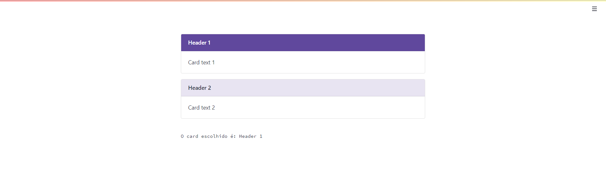

# streamlit-cardselectable: A flexible and extensible content container selectable in Streamlit! 

## Installation

```python
pip install streamlit-cardselectable
```

## Usage

Currently, there is one function defined:

`st_cardselectable()`: In this function there are some params: 

* `label`: label name.
* `options`: cards header.
* `explanation`: card text.
* `default` [optional]: index of the card that will be selected at the first moment.

## Example

### State: Initial


### State: Selected
